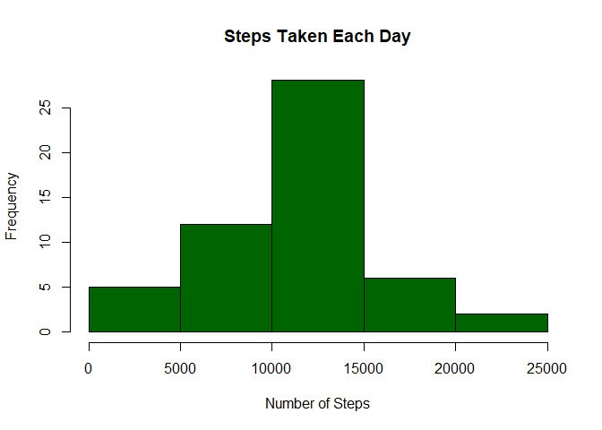
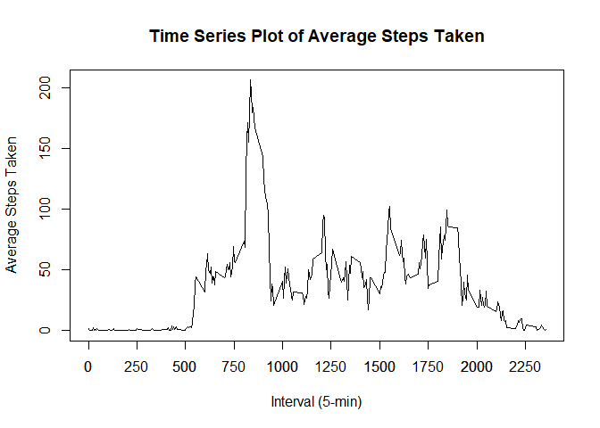
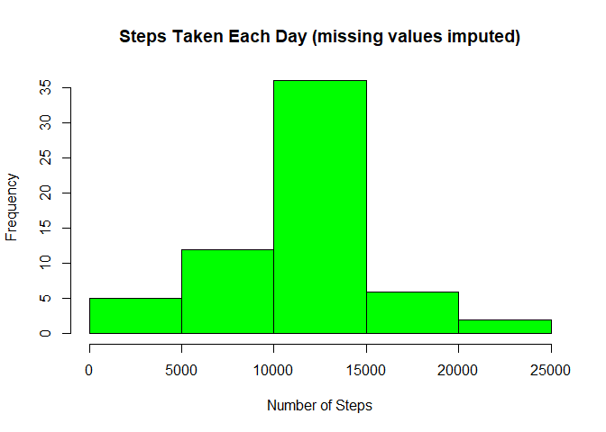
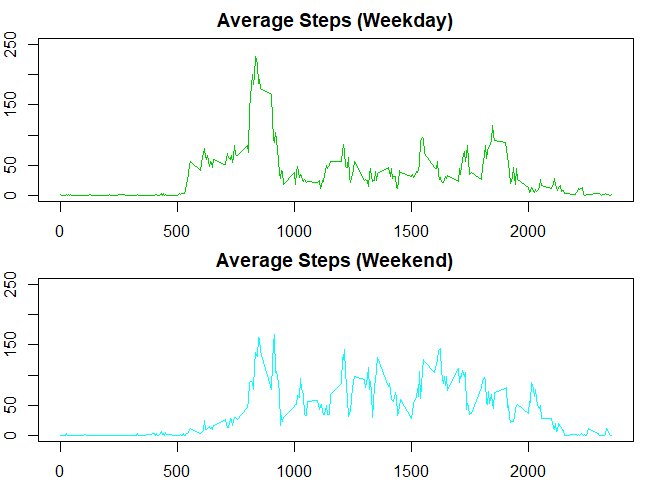

## Loading and preprocessing the data

```r
mydata <- read.csv(unz("activity.zip", "activity.csv"), header=T)
mydata$date <- as.Date(mydata$date)
str(mydata)
```

```
## 'data.frame':	17568 obs. of  3 variables:
##  $ steps   : int  NA NA NA NA NA NA NA NA NA NA ...
##  $ date    : Date, format: "2012-10-01" "2012-10-01" ...
##  $ interval: int  0 5 10 15 20 25 30 35 40 45 ...
```

## What is mean total number of steps taken per day?
### 1. Total number of steps taken per day

```r
data1 <- aggregate(mydata$steps, list(date=mydata$date), sum)
names(data1)[2] <- "totalsteps"
data1
```

```
##          date totalsteps
## 1  2012-10-01         NA
## 2  2012-10-02        126
## 3  2012-10-03      11352
## 4  2012-10-04      12116
## 5  2012-10-05      13294
## 6  2012-10-06      15420
## 7  2012-10-07      11015
## 8  2012-10-08         NA
## 9  2012-10-09      12811
## 10 2012-10-10       9900
## 11 2012-10-11      10304
## 12 2012-10-12      17382
## 13 2012-10-13      12426
## 14 2012-10-14      15098
## 15 2012-10-15      10139
## 16 2012-10-16      15084
## 17 2012-10-17      13452
## 18 2012-10-18      10056
## 19 2012-10-19      11829
## 20 2012-10-20      10395
## 21 2012-10-21       8821
## 22 2012-10-22      13460
## 23 2012-10-23       8918
## 24 2012-10-24       8355
## 25 2012-10-25       2492
## 26 2012-10-26       6778
## 27 2012-10-27      10119
## 28 2012-10-28      11458
## 29 2012-10-29       5018
## 30 2012-10-30       9819
## 31 2012-10-31      15414
## 32 2012-11-01         NA
## 33 2012-11-02      10600
## 34 2012-11-03      10571
## 35 2012-11-04         NA
## 36 2012-11-05      10439
## 37 2012-11-06       8334
## 38 2012-11-07      12883
## 39 2012-11-08       3219
## 40 2012-11-09         NA
## 41 2012-11-10         NA
## 42 2012-11-11      12608
## 43 2012-11-12      10765
## 44 2012-11-13       7336
## 45 2012-11-14         NA
## 46 2012-11-15         41
## 47 2012-11-16       5441
## 48 2012-11-17      14339
## 49 2012-11-18      15110
## 50 2012-11-19       8841
## 51 2012-11-20       4472
## 52 2012-11-21      12787
## 53 2012-11-22      20427
## 54 2012-11-23      21194
## 55 2012-11-24      14478
## 56 2012-11-25      11834
## 57 2012-11-26      11162
## 58 2012-11-27      13646
## 59 2012-11-28      10183
## 60 2012-11-29       7047
## 61 2012-11-30         NA
```
### 2. Histogram of total number of steps taken each day

```r
hist(data1$totalsteps, col = "darkgreen", main = "Steps Taken Each Day", xlab = "Number of Steps")
```

<!-- -->

### 3.1 Mean number of steps taken each day

```r
mean(data1$totalsteps, na.rm = TRUE)
```

```
## [1] 10766.19
```

### 3.2 Median number of steps taken each day

```r
median(data1$totalsteps, na.rm = TRUE)
```

```
## [1] 10765
```

## What is the average daily activity pattern?

### 1. Time series plot of average steps taken by interval

```r
data2 <- aggregate(mydata$steps, list(interval=mydata$interval), FUN=mean, na.rm=TRUE)
names(data2)[2] <- "avgsteps"
plot(data2$interval, data2$avgsteps, main = "Time Series Plot of Average Steps Taken", xlab = "Interval (5-min)", ylab = "Average Steps Taken", type="l", lty = 1)
axis(side=1, at=seq(0,2355, by=250))
```

<!-- -->

### 2. The 5-minute interval that, on average, contains the maximum number of steps

```r
data2[which.max(data2$avgsteps),]
```

```
##     interval avgsteps
## 104      835 206.1698
```


## Imputing missing values
### 1. Total number of missing values in the dataset

```r
sum(is.na(mydata$steps))
```

```
## [1] 2304
```

### 2. Strategy - Replacing missing values with average steps for the corresponding interval

```r
data3 <- merge(mydata, data2, by="interval")

for(i in 1:nrow(data3)){
  if(is.na(data3[i,2])) {
    data3[i,2] <- data3[i,4]}
  else {
    data3[i,2] <- data3[i,2]
  }
}
```

### 3. Histogram of the total number of steps taken each day with missing values imputed

```r
data4 <- aggregate(data3$steps, list(date=data3$date), sum)
names(data4)[2] <- "totalsteps"
hist(data4$totalsteps, col = "green", main = "Steps Taken Each Day (missing values imputed)", xlab = "Number of Steps")
```

<!-- -->

### 3.1 Mean number of steps taken each day with missing values imputed
#### Imputing missing values has no impact on mean value.

```r
mean(data4$totalsteps)
```

```
## [1] 10766.19
```

### 3.2 Median number of steps taken each day with missing values imputed
#### Imputing missing values results a median value that is equal to mean.

```r
median(data4$totalsteps)
```

```
## [1] 10766.19
```

## Are there differences in activity patterns between weekdays and weekends?
### 1. Categorize date into "Weekend" and "Weekday"

```r
data3$date <- as.Date(data3$date)

for(i in 1:nrow(data3)){
  if(weekdays(data3[i,3]) %in% c("Saturday","Sunday")) {
    data3[i,5] <- "Weekend"}
  else {
    data3[i,5] <- "Weekday"
  }
}
names(data3)[5] <- "category"
```

### 2. Create panel plot to compare average steps (imputed) by weekend and weekday

```r
data5 <- aggregate(data3$steps, list(interval=data3$interval, category=data3$category), FUN=mean)

par(mfrow=c(2,1), mar=c(2,2,2,2))
with(subset(data5, category=="Weekday"), plot(interval,x,type="l", main = "Average Steps (Weekday)", xlab = "Interval (5-min)", ylab = "Average Steps Taken", col=491,  ylim=c(0,250)))
with(subset(data5, category=="Weekend"), plot(interval,x,type="l", main = "Average Steps (Weekend)", xlab = "Interval (5-min)", ylab = "Average Steps Taken", col=373,  ylim=c(0,250)))
```

<!-- -->


